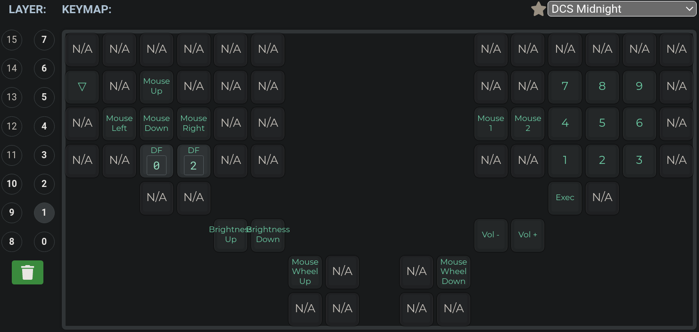
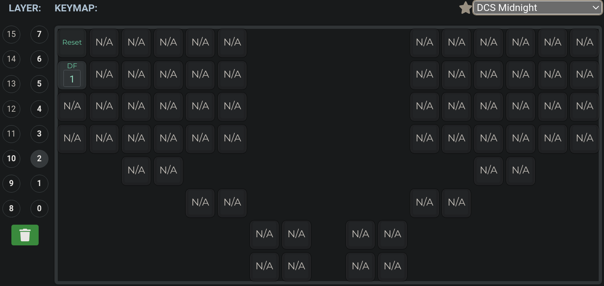

## This is my dactyl manuform keymaps.c

If you don't know what is qmk or keymaps.c you schould visit [qmk docs](https://docs.qmk.fm/#/)  

If you are starting(like me) this is perfect config for you. I tried to keep it simple and I tried to explain what everything does.

Starting with keymaps on [qmk configurator](https://config.qmk.fm/#/handwired/dactyl_manuform/5x6/LAYOUT_5x6) I will show you how does this config look in the gui.

# This is first mode
It contains config for normal qwerty mode keyboard with some tweaks.

# This is second mode(mouse and numpad)
It contains keys for using mouse, changing volume and brightness and exec key. 

# this is reset mode
It contains only the key to reset keyboard and a key to go back to first mode

# If you want to just simply flash your keyboard download [this file](https://github.com/Grandkahuna43325/dactyl_manuform_config/blob/main/keymaps.json) and upload it to [qmk configurator](https://config.qmk.fm/#/handwired/dactyl_manuform/5x6/LAYOUT_5x6). Then press compile and select the downloaded file in your qmk toolbox. I won't cover how to do it and what is qmk toolbox, you schould find it in [qmk docs](https://docs.qmk.fm/#/).

## If you want to dig a little deeper and have more controll over your config you schould do more reading about it in [qmk docs](https://docs.qmk.fm/#/) and then if you want download [keymaps.c](https://github.com/Grandkahuna43325/dactyl_manuform_config/blob/main/keymaps.c)

