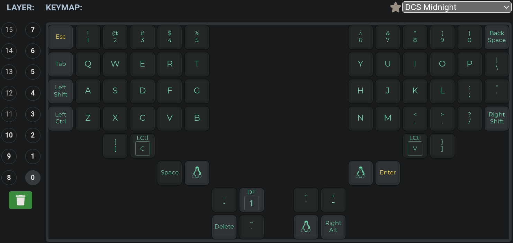

## This is my dactyl manuform keymaps.c

If you don't know what is qmk or keymaps.c you schould visit [qmk docs](https://docs.qmk.fm/#/)  

If you are starting(like me) this is perfect config for you. I tried to keep it simple and later on I will explain what everything does.

